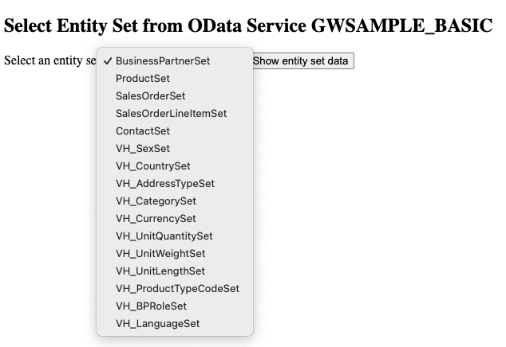

# Parse the Metadata from an SAP OData Service

This is a work in progress!

Parse the metadata XML describing an SAP OData service and generate basic Rust entities for each EDM type:

* [x] `ComplexType`
* [x] `EntityType`
* [ ] `FunctionImport`

> ***Limitations***
>
> Currently when generating a Rust `struct`, only the `Name` and `Type` properties are extracted from the XML `<EntityType>` declaration.
>
> ***TODO***<br>Consider how the other XML attribute values and SAP annotations could be made available within the generated Rust `struct`.

---
## Usage

### Declare Build Dependency

In the `Cargo.toml` of your application, define an entry in `[build-dependencies]` that points to the `parse-sap-odata` crate:

```toml
[build-dependencies]
parse-sap-odata = "^1.1.0"
```

Your app will require at least these dependencies:

```toml
[dependencies]
chrono = { version = "^0.4", features = ["serde"] }
rust_decimal = "^1.30"
serde = { version = "^1.0", features = ["derive"] }
uuid = { version = "^1.4", features = ["serde"] }
```

### Create a Build Script

In your app's build script (`build.rs`), run the generator for your desired OData service:

```rust
use parse_sap_odata::parser::gen_src;

fn main() {
    gen_src(
        "gwsample_basic", // metadata_file_name.  The ".xml" extension is assumed
        "GWSAMPLE_BASIC"  // Value of the Namespace attribute on the <Schema> tag
    );
}
```

More information about Rust [build scripts](https://doc.rust-lang.org/cargo/reference/build-scripts.html) is available on the documentation site.

### XML Input Files

All metadata XML for the OData services your app consumes must be located in the `./odata` directory immediately under your app's top level directory.

Using the above example from SAP's Dev Center server, the [OData metadata XML](https://sapes5.sapdevcenter.com/sap/opu/odata/iwbep/GWSAMPLE_BASIC/$metadata) for service [`GWSAMPLE_BASIC`](https://sapes5.sapdevcenter.com/sap/opu/odata/iwbep/GWSAMPLE_BASIC/) must be located in file [`./odata/gwsample_basic.xml`](./build_test_app/odata/gwsample_basic.xml)

### Generated Output

If `cargo` detects a `build.rs` file in your project/crate, then it automatically populates the environment variable `OUT_DIR` and runs `build.rs` before compiling your application.

The `OUT_DIR` variable then points to the directory into which all build script output is written.

The default directory name is `target/debug/build/<your_package_name>/out`, and this is where you can find the generated `struct` declarations for the OData service.

You can specify your own value for `OUT_DIR` either by passing a value to `cargo`'s `--out_dir` flag, or by defining your own location in a `config.toml` file in the `./.cargo` directory.
See [Cargo Configuration](https://doc.rust-lang.org/cargo/reference/config.html) for more details.

All generated `struct`s implement `#[derive(Clone, Debug, Default)]`

---

## Referencing Generated Output

Since `cargo` runs the build script before compiling your application code, the source code of your application can reference the generated `structs` like this:

```rust
// Include the generated code
include!(concat!(env!("OUT_DIR"), "/gwsample_basic.rs"));

// Use the BusinessPartner struct for example
fn main() {
    let bp: BusinessPartner = Default::default();
    println!("{:#?}", bp);
}
```

---

## OData Complex Types

In the event an Entity Type definition uses a complex type, then the complex type is first created as a Rust `struct`.
The field in Rust `struct` that has this complex type is then defined using this `struct`.

An example of this is the `Address` property.

```xml
<EntityType Name="BusinessPartner" sap:content-version="1">
  <Key>
    <PropertyRef Name="BusinessPartnerID"/>
  </Key>
  <Property Name="Address" Type="GWSAMPLE_BASIC.CT_Address" Nullable="false"/>

  <!-- SNIP -->

</EntityType>
```

The Rust `struct` name is generated by trimming the namespace qualifier and (if present) the `CT_` prefix

```xml
<ComplexType Name="CT_Address">
  <Property Name="City" Type="Edm.String" MaxLength="40" sap:label="City" sap:semantics="city"/>
  <Property Name="PostalCode" Type="Edm.String" MaxLength="10" sap:label="Postal Code" sap:semantics="zip"/>
  <Property Name="Street" Type="Edm.String" MaxLength="60" sap:label="Street" sap:semantics="street"/>
  <Property Name="Building" Type="Edm.String" MaxLength="10" sap:label="Building"/>
  <Property Name="Country" Type="Edm.String" MaxLength="3" sap:label="Country" sap:semantics="country"/>
  <Property Name="AddressType" Type="Edm.String" MaxLength="2" sap:label="Address Type"/>
</ComplexType>
```

So the above XML definition becomes:

```rust
#[derive(Clone, Debug, Default)]
pub struct Address {
    pub address_type: Option<String>,
    pub building: Option<String>,
    pub city: Option<String>,
    pub country: Option<String>,
    pub postal_code: Option<String>,
    pub street: Option<String>,
}
```

---

## OData "Simple" Complex Types

The metadata for the `GWSAMPLE_BASIC` OData service contains the following complex type:

```xml
<ComplexType Name="CT_String">
  <Property Name="String" Type="Edm.String" Nullable="false" sap:creatable="false" sap:updatable="false" sap:sortable="false" sap:filterable="false"/>
</ComplexType>
```

Allowing for the current situation in which additional attribute values and SAP Annotations are not preserved, this particular type turns out not to be complex at all &mdash; its just a `String`.
In such cases, fields declared to be of these "simple" complex types (such as `CT_String`), are collapsed down to the Rust native type of the single inner property &mdash; which in this example is simply a `String`.

---

## Entity Sets Enum

On the basis that a single OData service exposes a static list of entity sets, and within the scope of any single request, you will only ever be interacting with a single entity set, it makes sense to treat each entity set name as an `enum` variant.

Under the `<Schema>` element in the OData service document, there is an `<EntityContainer>` element.
All entity sets available through this OData service are identified here with their own `<EntitySet Name="<some_name>">` tag.

The following naming convention is used: `<odata_service_name>Entities`.

For example, the entity sets belonging to the OData service `GWSAMPLE_BASIC` become the following `enum`:

```rust
#[derive(Copy, Clone, Debug)]
pub enum GwsampleBasicEntities {
    BusinessPartnerSet,
    ProductSet,
    SalesOrderSet,
    SalesOrderLineItemSet,
    ContactSet,
    VhSexSet,
    VhCountrySet,
    VhAddressTypeSet,
    VhCategorySet,
    VhCurrencySet,
    VhUnitQuantitySet,
    VhUnitWeightSet,
    VhUnitLengthSet,
    VhProductTypeCodeSet,
    VhBpRoleSet,
    VhLanguageSet,
}
```

Three convenience functions are then implemented for `enum GwsampleBasicEntities`:

```rust
impl GwsampleBasicEntities {
    pub const fn value(&self) -> &'static str { /* SNIP */ }
    pub fn iterator() -> impl Iterator<Item = GwsampleBasicEntities> { /* SNIP */ }
    pub fn as_list() -> Vec<&'static str> { /* SNIP */ }
}
```

### Entity Set Enum `value` function

This function returns the name of the entity set variant as a static string slice:

```rust
GwsampleBasicEntities::ProductSet::value();   // -> "ProductSet"
```

### Entity Set Enum `iterator` function

For standard Rust `enums` such as `Option` and `Result`, it makes little sense to attempt to loop over their variants simply because these `enum`s exist specifically to gather together diverse types into a single object.
E.G. The `Option` `enum` exists to provide a type-safe mechanism for handling the possibility that a variable might not contain a value.

However, an OData service guarantees that the entity set names form an immutable, type-safe list.
Therefore, on the basis of this guarantee, it is now both safe and meaningful to implement an `iterator` function.

### Entity Set Enum `as_list` function

By making use of the above `iterator` and `value` functions, the `as_list` function returns the names of the entity sets as a vector of string slices.

---

## TODOs

1. Consider fetching the metadata at build time &mdash; but this raises the question of whether allowing a build script to look outside its sandbox is an anti-pattern...
1. Implement `serde` directives for the generated `structs`
1. Support Function Imports

---

## Testing this Crate Locally

The prefered test tool is [`nextest`](https://crates.io/crates/cargo-nextest) which can be [installed from here](https://nexte.st/).

If you have not installed `nextest`, `cargo test` can be used instead.

```bash
$ cargo nextest run
    Finished test [unoptimized + debuginfo] target(s) in 0.15s
    Starting 9 tests across 1 binary
        PASS [   0.032s] parse-sap-odata edmx::data_services::schema::association::referential_constraint::unit_tests::should_parse_referntial_constraint
        PASS [   0.033s] parse-sap-odata edmx::data_services::schema::association::unit_tests::should_parse_association_set
        PASS [   0.035s] parse-sap-odata edmx::data_services::schema::entity_container::unit_tests::should_parse_association_set
        PASS [   0.037s] parse-sap-odata edmx::data_services::schema::entity_container::unit_tests::should_parse_entity_container
        PASS [   0.036s] parse-sap-odata edmx::data_services::schema::entity_container::unit_tests::should_parse_entity_set
        PASS [   0.034s] parse-sap-odata property::unit_tests::should_convert_unsafe_property_name
        PASS [   0.033s] parse-sap-odata property::unit_tests::should_not_convert_safe_property_name
        PASS [   0.038s] parse-sap-odata edmx::data_services::schema::entity_type::unit_tests::should_parse_entity_type_business_partner
        PASS [   0.037s] parse-sap-odata edmx::data_services::schema::entity_type::unit_tests::should_parse_entity_type_product
------------
     Summary [   0.046s] 9 tests run: 9 passed, 0 skipped
```

## Test App Built Using Generated Source Code

The `build_test_app` subdirectory contains a test Rust app that consumes the SAP sample OData service `GWSAMPLE_BASIC`.

### Prerequisites

You must already have a userid and password for the SAP Dev Center server `sapes5.sapdevcenter.com`

1. Clone this repo
1. `cd parse_sap_odata/build_test_app`
1. Create a `.env` file containing your SAP DevCenter userid and password in the following format

   ```
   SAP_USER=<your userid>
   SAP_PASSWORD=<your password>
   ```

### Running `build_test_app`


1. In directory `build_test_app` run `cargo run`
1. Open your browser and go to <http://localhost:8080>
1. Select the name of the entity set whose data you want to see
    
1. You will then see the first 100 entries from the selected entity set in JSON format.
