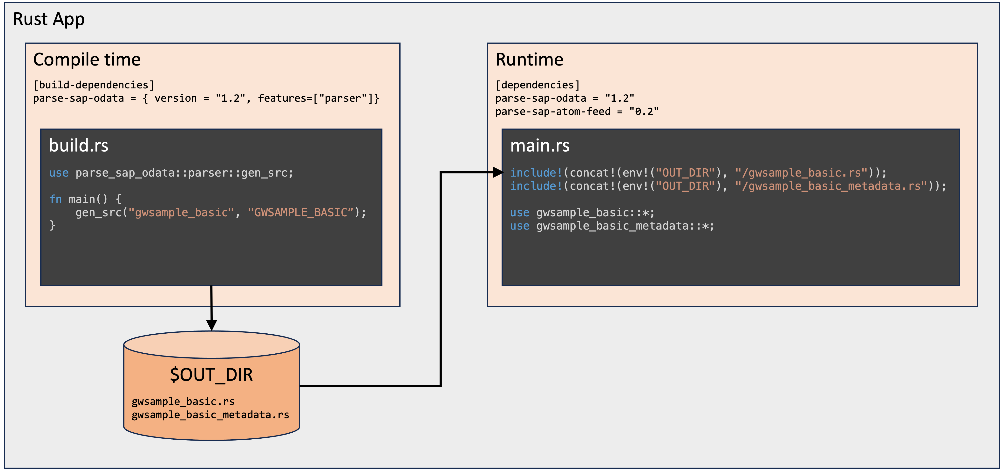

# Usage

You want to write a Rust application to consume the data exposed through an SAP OData V2 service.

The functionality in this crate is invoked by your application's build script and generates two Rust modules.
For example, if you wish to consume the demo OData service `GWSAMPLE_BASIC`, then after parsing this service's metadata document, the following two modules will be generated:

* `gwsample_basic.rs`
* `gwsample_basic_metadata.rs`


## Declare a Build Dependency

In the `Cargo.toml` of your application, define an entry in `[build-dependencies]` that points to the `parse-sap-odata` crate with the create feature `parser` switched on:

```toml
[build-dependencies]
parse-sap-odata = { version = "1.2", features = ["parser"]}
```

This create feature switches on the ability to generate the source code for the service document and metadata of your selected OData service.
Consequently, this functionality is only required at build time.

## Declare a Dependency

Your app will require at least these dependencies:

```toml
[dependencies]
chrono = { version = "0.4", features = ["serde"] }
parse-sap-odata = "1.2"
parse-sap-atom-feed = "0.2"
rust_decimal = { version = "1.30", features = ["serde-with-str"]}
serde = { version = "1.0", features = ["derive"] }
uuid = { version = "1.4", features = ["serde"] }
```

A dependency on crate `parse-sap-odata` (without the `parser` feature enabled) allows you to consume the OData service metadata at runtime.
This is needed if you want to access any of the SAP annotations that might exist for the runtime data.

A dependency on crate [`parse-sap-atom-feed`](https://crates.io/crates/parse-sap-atom-feed) allows you to consume entity set data from the OData service.

## XML Input Files

All metadata XML for the OData services your app consumes must be located in the `./odata` directory immediately under your app's root directory.

Using the demo service `GWSAMPLE_BASIC` available from SAP's Dev Center server, display the [metadata XML](https://sapes5.sapdevcenter.com/sap/opu/odata/iwbep/GWSAMPLE_BASIC/$metadata) for this service, then save it in file `./odata/gwsample_basic.xml`.

## Create a Build Script

In your app's build script (`build.rs`), run the generator for your desired OData service:

```rust
use parse_sap_odata::parser::gen_src;

fn main() {
    gen_src(
        "gwsample_basic", // metadata_file_name.  The ".xml" extension is assumed
        "GWSAMPLE_BASIC"  // Value of the Namespace attribute on the <Schema> tag
    );
}
```

More information about Rust [build scripts](https://doc.rust-lang.org/cargo/reference/build-scripts.html) is available on the Rust documentation site.

## Generated Output

If `cargo` detects a `build.rs` file in your project/crate, then this file is compiled an run before your application is compiled.

Any output generated by `build.rs` will be written to a build directory whose name is stored in the environment variable `OUT_DIR`.
This includes not only the generated Rust modules, but also any error messages that might be produced during the code generation steps.

The default directory into which all `build.rs` output is written is `target/[debug|release]/build/<your_package_name>/out`, but you do not need to remember this specifically as the value can be obtained by calling the Rust macro `env!("OUT_DIR")`.

You can specify your own value for `OUT_DIR` either by passing a value to `cargo`'s `--out_dir` flag, or by defining your own location in a `config.toml` file in the `./.cargo` directory.
See [Cargo Configuration](https://doc.rust-lang.org/cargo/reference/config.html) for more details.

All generated `struct`s implement at least the following traits `#[derive(Clone, Debug, Default)]`

---

# Referencing Generated Output

In the source code of your application, use the `include!()` macro to pull in the generated source code, then bring the generated module into scope with a `use` command:

```rust
// Include the generated code
include!(concat!(env!("OUT_DIR"), "/gwsample_basic.rs"));

use gwsample_basic::*;

// Use the BusinessPartner struct for example
fn main() {
    let bp: BusinessPartner = Default::default();
    println!("{:#?}", bp);
}
```
